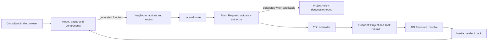

# Architecture

This document describes how the Project Checklist app is built internally:
the architectural style, the path a request takes from a browser click to the
response on screen, the data model, the Health Indicator rule, and how
authorization keeps one consultant from seeing another's data.

## Overview

The project is a **Laravel + Inertia.js monolith**: there is no separate REST
API and no independently deployed frontend. React runs inside the same pages
Laravel serves, and Inertia is the "glue" between the two — it swaps out the
data for a navigation without reloading the whole page, without the
complexity of a traditional SPA (no duplicated client-side routes, no custom
HTTP client per endpoint, no manually synchronized global state).

Each screen is a React component in `resources/js/pages`, rendered from an
`Inertia::render()` call in the matching controller. The props the controller
passes arrive already typed in the component; there is no loose JSON or API
contract to keep in sync by hand, because **Laravel Wayfinder** generates
TypeScript functions from the PHP routes and controllers (see
[TECHNOLOGIES.md](TECHNOLOGIES.md)).

## The path of a request

Every action in the application follows the same shape of flow. In order:

1. **React** triggers the action — a `<Form>`, a `router.get()/patch()` call,
   or (as on the Kanban board) Inertia v3's `router.optimistic()`.
2. A function generated by **Wayfinder** (`resources/js/actions/...` or
   `resources/js/routes/...`) builds the correct URL and HTTP method from the
   controller or named route — no hand-written route strings in the frontend.
3. Laravel resolves the **route** (`routes/projects.php`, `routes/web.php`,
   etc.) and passes the request through the **middleware** stack
   (authentication, `HandleAppearance`, `HandleInertiaRequests`).
4. A **Form Request** (`app/Http/Requests/...`) validates the input and
   resolves `authorize()` — in some cases delegating to a **Policy**
   (`app/Policies/ProjectPolicy.php`).
5. The **controller**, deliberately thin, calls Eloquent and returns a
   response (`RedirectResponse` or `Inertia\Response`).
6. **Eloquent** (`app/Models/Project.php`, `app/Models/Task.php`) applies the
   business rules through local scopes and the enums in `app/Enums`.
7. When the response is a page, an **API Resource**
   (`app/Http/Resources/...`) serializes the model with `->resolve($request)`,
   already including computed fields (such as `health`).
8. **Inertia** returns the new props to the React component, which
   re-renders only what changed.

```
React (user action)
  -> Wayfinder-generated function (actions/routes)
  -> route (routes/*.php) + middleware
  -> Form Request (validation + authorize()) [-> Policy]
  -> Controller (thin)
  -> Eloquent (Models + Enums + scopes)
  -> API Resource (->resolve())
  -> Inertia::render() / back()
  -> React (new props, re-renders)
```

### Real example: moving a task on the Kanban board

Dragging a task card into another column goes through exactly this flow, with
one extra detail: Inertia v3's **optimistic update**.

1. `resources/js/components/tasks/kanban-board.tsx` captures the end of the
   drag (`onDragEnd` from `@dnd-kit`) and calls `onStatusChange(task, status)`.
2. `resources/js/pages/projects/show.tsx` implements that callback with
   `router.optimistic<ProjectBoardProps>(...)`: before the server even
   responds, it already updates the in-memory task list so the card shows in
   its new column. If the request fails (validation error, network error, or
   an HTTP exception), Inertia rolls that change back on its own and a toast
   notifies the user — there is no need to manually save and restore the
   previous state.
3. In parallel, the Wayfinder-generated function builds a `PATCH` to
   `tasks/{task}/status`, which the named route `tasks.status.update`
   (`routes/projects.php`) routes to `TaskStatusController`.
4. `App\Http\Requests\Tasks\UpdateTaskStatusRequest::authorize()` looks up the
   task's project (`$task->project`) and delegates the decision to
   `Gate::inspect('update', $task->project)` — in other words, authorizing a
   task always goes through its owning project's policy, never through a
   policy of its own for `Task`.
5. `TaskStatusController::__invoke()`
   (`app/Http/Controllers/TaskStatusController.php`) is deliberately short: it
   just calls `$task->update(['status' => ...])` and returns `back()`. There
   is no success toast on the backend side — the card already moved on screen
   thanks to the optimistic update, and an extra toast would be noise.
6. Inertia reprocesses the previous page with `only: ['project', 'tasks',
   'filters']`, so only those three sets of props are recomputed and sent
   back — the rest of the page is untouched.

## Data model

The domain has two tables, linked by a foreign key with cascading deletes:

| Table | Main columns | Notes |
|---|---|---|
| `projects` | `id`, `user_id`, `name`, `description` | `user_id` points to the owning consultant; deleting the consultant — under Settings > Profile, "Delete account" (`<DeleteUser />`) — cascades to their projects. |
| `tasks` | `id`, `project_id`, `title`, `description`, `status`, `priority`, `deadline` | `status` and `priority` are string-backed enums; `deadline` is a `dateTime` (date and time); deleting the project cascades to its tasks. |

The domain's three enums live in `app/Enums`:

- `App\Enums\TaskStatus` — `Pending`, `InProgress`, `Completed`.
- `App\Enums\TaskPriority` — `Low`, `Medium`, `High`.
- `App\Enums\ProjectHealthStatus` — `NoTasks`, `Healthy`, `Alert`; this is not
  a database column, it is always computed (see the next section).

All three enums use the `App\Concerns\HasOptions` trait, which exposes each
case as a `{value, label}` pair (`toOption()`) and the full list of cases
(`options()`) — this is how the frontend receives `<select>` options without
duplicating the Portuguese labels in TypeScript.

## The Health Indicator rule

The Health Indicator is never written to the database: it is recomputed on
every read, from two counts aggregated in a single SQL query.

1. **`Task::overdue()`** (local scope in `app/Models/Task.php`) is the single
   definition of an "overdue task" in the whole system: a `deadline` in the
   past **and** a `status` other than `Completed`. Every rule that depends on
   being overdue uses this same definition: the Health Indicator queries the
   scope directly; a task's `is_overdue` field is an accessor
   (`isOverdue()`, in `app/Models/Task.php`) that repeats the same rule in
   PHP, without depending on a query — fixing the rule requires updating
   both places.
2. **`Project::withTaskCounts()`** (local scope in `app/Models/Project.php`)
   uses `withCount()` to fetch, in a single query, the project's total task
   count, how many are overdue (reusing `overdue()`), and how many are
   completed.
3. **`ProjectHealthStatus::fromCounts(int $totalTasks, int $overdueTasks)`**
   (`app/Enums/ProjectHealthStatus.php`) turns those two counts into the
   project's state:
   - no tasks → `NoTasks`;
   - `overdueTasks * 100 > totalTasks * 20` → `Alert`;
   - otherwise → `Healthy`.

   The comparison uses **integer arithmetic** (multiplication instead of
   division) on purpose: computing the percentage with floating-point numbers
   and comparing against `20.0` risks rounding errors right at the 20%
   boundary, which is exactly the most heavily tested case in the system.
   Multiplying both sides by 100 and by 20 avoids any division and keeps the
   comparison exact.

**Why the indicator is not persisted:** a task becomes overdue purely because
time passed — no write happens to the database at that instant. If the
"Healthy"/"Alert" state were stored in a column, it would go stale as soon as
the clock moved past some task's deadline, and keeping that value correct
would require a scheduled job just for that. Computing the indicator on read,
with one SQL aggregation per listing, keeps the result always correct at the
cost of a single extra query.

## Authorization

Authorization for projects and tasks lives entirely in
`App\Policies\ProjectPolicy` (`app/Policies/ProjectPolicy.php`). The `view`,
`update`, and `delete` methods all call the same private `ownership()`
method:

```php
private function ownership(User $user, Project $project): Response
{
    return $user->id === $project->user_id
        ? Response::allow()
        : Response::denyAsNotFound();
}
```

The key detail is `Response::denyAsNotFound()`: instead of returning 403
(forbidden), the policy returns 404 (not found) when the project does not
belong to the authenticated user. This keeps the application from revealing,
even indirectly, that a project with that ID exists — for someone who isn't
the owner, requesting `/projects/17` looks identical to it not existing at
all.

Since a task has no owner of its own, actions on tasks (changing status,
editing, deleting) always authorize against the task's **project**
(`$task->project`), delegating to the same policy — there is no separate
`TaskPolicy`.

## Folder map

```
app/
  Actions/Fortify/        # Fortify registration flow customization
  Concerns/               # reusable traits (validation rules, HasOptions)
  Enums/                  # TaskStatus, TaskPriority, ProjectHealthStatus
  Http/
    Controllers/          # thin controllers (Project, Task, TaskStatus, Dashboard, Settings/*)
    Requests/              # Form Requests (validation + authorize())
    Resources/             # ProjectResource, TaskResource
  Models/                 # Project, Task, User
  Policies/               # ProjectPolicy
  Providers/              # AppServiceProvider, FortifyServiceProvider

routes/
  web.php                 # home page + includes
  projects.php            # projects/tasks/status routes
  settings.php            # profile/security routes

resources/js/
  actions/, routes/       # generated by Wayfinder (do not edit by hand)
  pages/                  # Inertia pages (dashboard, projects/show, auth/*, settings/*)
  components/
    projects/, tasks/     # HealthBadge, ProjectCard, KanbanBoard, TaskCard, TaskFilters
    ui/                   # shadcn/ui base components
```

## Diagram


