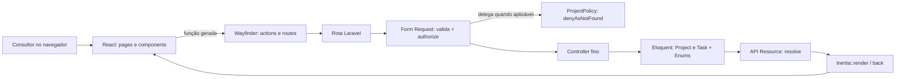

# Arquitetura

Este documento descreve como o Checklist de Projetos é construído por dentro: o
estilo arquitetural, o caminho de uma requisição do clique no navegador até a
resposta na tela, o modelo de dados, a regra do Indicador de Saúde e como a
autorização impede que um consultor veja os dados de outro.

## Visão geral

O projeto é um **monólito Laravel + Inertia.js**: não existe uma API REST
separada nem um frontend publicado à parte. O React roda dentro das mesmas
páginas que o Laravel serve, e o Inertia é a "cola" entre os dois — ele troca
os dados de uma navegação sem recarregar a página inteira, mas sem exigir a
complexidade de uma SPA tradicional (sem rotas duplicadas no cliente, sem
cliente HTTP customizado para cada endpoint, sem sincronizar estado global à
mão).

Cada tela é um componente React em `resources/js/pages`, renderizado a partir
de um `Inertia::render()` no controller correspondente. As props que o
controller passa chegam tipadas no componente; não há JSON solto nem contrato
de API para manter sincronizado manualmente, porque o **Laravel Wayfinder**
gera funções TypeScript a partir das rotas e dos controllers PHP (veja
[TECNOLOGIAS.md](TECNOLOGIAS.md)).

## O caminho de uma requisição

Todas as ações da aplicação passam pelo mesmo formato de fluxo. Em ordem:

1. **React** dispara a ação — um `<Form>`, um `router.get()/patch()` ou (como
   no Kanban) `router.optimistic()` do Inertia v3.
2. Uma função gerada pelo **Wayfinder** (`resources/js/actions/...` ou
   `resources/js/routes/...`) monta a URL e o método HTTP corretos a partir do
   controller ou da rota nomeada — sem strings de rota escritas à mão no
   frontend.
3. O Laravel resolve a **rota** (`routes/projects.php`, `routes/web.php` etc.)
   e passa a requisição pelos **middlewares** (autenticação, `HandleAppearance`,
   `HandleInertiaRequests`).
4. Um **Form Request** (`app/Http/Requests/...`) valida a entrada e resolve
   `authorize()` — em alguns casos delegando para uma **Policy**
   (`app/Policies/ProjectPolicy.php`).
5. O **controller**, propositalmente magro, chama o Eloquent e devolve uma
   resposta (`RedirectResponse` ou `Inertia\Response`).
6. O **Eloquent** (`app/Models/Project.php`, `app/Models/Task.php`) aplica as
   regras de negócio via *local scopes* e os enums de `app/Enums`.
7. Quando a resposta é uma página, um **API Resource**
   (`app/Http/Resources/...`) serializa o model com `->resolve($request)`,
   já incluindo campos calculados (como `health`).
8. O **Inertia** devolve as novas props para o componente React, que
   re-renderiza só o necessário.

```
React (ação do usuário)
  -> função gerada pelo Wayfinder (actions/routes)
  -> rota (routes/*.php) + middlewares
  -> Form Request (validação + authorize()) [-> Policy]
  -> Controller (fino)
  -> Eloquent (Models + Enums + scopes)
  -> API Resource (->resolve())
  -> Inertia::render() / back()
  -> React (novas props, re-renderiza)
```

### Exemplo real: mover uma tarefa no Kanban

Arrastar um cartão de tarefa para outra coluna percorre exatamente esse fluxo,
com um detalhe extra: a **atualização otimista** do Inertia v3.

1. `resources/js/components/tasks/kanban-board.tsx` captura o fim do
   arrasto (`onDragEnd` do `@dnd-kit`) e chama `onStatusChange(task, status)`.
2. `resources/js/pages/projects/show.tsx` implementa esse callback com
   `router.optimistic<ProjectBoardProps>(...)`: antes mesmo de o servidor
   responder, ele já atualiza a lista de tarefas em memória para mostrar o
   cartão na nova coluna. Se a requisição falhar (erro de validação, erro de
   rede ou HTTP), o Inertia desfaz essa mudança sozinho e um `toast` de erro
   avisa o usuário — não há necessidade de guardar e restaurar o estado
   anterior manualmente.
3. Em paralelo, a função gerada pelo Wayfinder monta um `PATCH` para
   `tasks/{task}/status`, que a rota nomeada `tasks.status.update`
   (`routes/projects.php`) direciona para `TaskStatusController`.
4. `App\Http\Requests\Tasks\UpdateTaskStatusRequest::authorize()` busca o
   projeto da tarefa (`$task->project`) e delega a decisão para
   `Gate::inspect('update', $task->project)` — ou seja, a autorização de uma
   tarefa sempre passa pela política do projeto dono dela, nunca por uma
   política própria de `Task`.
5. `TaskStatusController::__invoke()` (`app/Http/Controllers/TaskStatusController.php`)
   é propositalmente curto: só chama `$task->update(['status' => ...])` e
   devolve `back()`. Não há toast de sucesso no backend — o cartão já se
   moveu na tela por causa da atualização otimista, e um toast a mais seria
   ruído.
6. O Inertia reprocessa a página anterior com `only: ['project', 'tasks',
   'filters']`, então só esses três conjuntos de props são recalculados e
   reenviados — o resto da página não é tocado.

## Modelo de dados

O domínio tem duas tabelas, ligadas por uma chave estrangeira com exclusão em
cascata:

| Tabela | Colunas principais | Observações |
|---|---|---|
| `projects` | `id`, `user_id`, `name`, `description` | `user_id` aponta para o consultor dono; ao excluir o consultor (não exposto na UI), os projetos são excluídos em cascata. |
| `tasks` | `id`, `project_id`, `title`, `description`, `status`, `priority`, `deadline` | `status` e `priority` são enums de string; `deadline` é `dateTime` (data e hora); ao excluir o projeto, as tarefas são excluídas em cascata. |

Os três enums do domínio vivem em `app/Enums`:

- `App\Enums\TaskStatus` — `Pending` (Pendente), `InProgress` (Em Andamento),
  `Completed` (Concluída).
- `App\Enums\TaskPriority` — `Low` (Baixa), `Medium` (Média), `High` (Alta).
- `App\Enums\ProjectHealthStatus` — `NoTasks` (Sem tarefas), `Healthy`
  (Saudável), `Alert` (Em Alerta); não é uma coluna do banco, é sempre
  calculado (veja a seção seguinte).

Os três enums usam a trait `App\Concerns\HasOptions`, que expõe cada caso como
um par `{value, label}` (`toOption()`) e a lista completa de casos
(`options()`) — é assim que o frontend recebe as opções de um `<select>` sem
duplicar os rótulos em português no TypeScript.

## A regra do Indicador de Saúde

O Indicador de Saúde nunca é gravado no banco: ele é recalculado a cada
leitura, a partir de duas contagens agregadas em uma única consulta SQL.

1. **`Task::overdue()`** (local scope em `app/Models/Task.php`) é a única
   definição de "tarefa atrasada" em todo o sistema: `deadline` no passado
   **e** `status` diferente de `Completed`. Toda regra que depende de atraso —
   o Indicador de Saúde, o campo `is_overdue` de uma tarefa — passa por este
   scope, então corrigir a regra num só lugar corrige todo o resto.
2. **`Project::withTaskCounts()`** (local scope em `app/Models/Project.php`)
   usa `withCount()` para trazer, numa única query, o total de tarefas do
   projeto, quantas estão atrasadas (reutilizando `overdue()`) e quantas estão
   concluídas.
3. **`ProjectHealthStatus::fromCounts(int $totalTasks, int $overdueTasks)`**
   (`app/Enums/ProjectHealthStatus.php`) transforma essas duas contagens no
   estado do projeto:
   - sem tarefas → `NoTasks`;
   - `overdueTasks * 100 > totalTasks * 20` → `Alert`;
   - caso contrário → `Healthy`.

   A comparação usa **aritmética inteira** (multiplicação em vez de divisão)
   de propósito: calcular a porcentagem com ponto flutuante e comparar com
   `20.0` arrisca erros de arredondamento bem na borda dos 20%, que é
   exatamente o caso mais testado do sistema. Multiplicar os dois lados por
   100 e por 20 evita qualquer divisão e mantém a comparação exata.

**Por que o indicador não é persistido:** uma tarefa fica atrasada só porque o
tempo passou — nenhuma escrita acontece no banco nesse instante. Se o estado
"Saudável"/"Em Alerta" fosse gravado numa coluna, ele ficaria desatualizado
assim que o relógio avançasse além do prazo de alguma tarefa, e manter esse
valor correto exigiria um job agendado só para isso. Calculando o indicador na
leitura, com uma agregação SQL por listagem, o resultado está sempre certo e
custa apenas uma consulta extra.

## Autorização

A autorização de projetos e tarefas está inteira em
`App\Policies\ProjectPolicy` (`app/Policies/ProjectPolicy.php`). Os métodos
`view`, `update` e `delete` chamam todos o mesmo método privado `ownership()`:

```php
private function ownership(User $user, Project $project): Response
{
    return $user->id === $project->user_id
        ? Response::allow()
        : Response::denyAsNotFound();
}
```

O ponto importante é `Response::denyAsNotFound()`: em vez de devolver 403
(proibido), a política devolve 404 (não encontrado) quando o projeto não
pertence ao usuário autenticado. Isso evita que a aplicação revele, mesmo que
indiretamente, que um projeto com aquele ID existe — para quem não é dono,
tentar acessar `/projects/17` parece idêntico a ele não existir.

Como uma tarefa não tem dono próprio, as ações sobre tarefas (mudar status,
editar, excluir) sempre autorizam contra o **projeto** da tarefa
(`$task->project`), delegando para a mesma política — não existe uma
`TaskPolicy` separada.

## Mapa de pastas

```
app/
  Actions/Fortify/        # customização do fluxo de cadastro do Fortify
  Concerns/               # traits reutilizadas (regras de validação, HasOptions)
  Enums/                  # TaskStatus, TaskPriority, ProjectHealthStatus
  Http/
    Controllers/          # controllers finos (Project, Task, TaskStatus, Dashboard, Settings/*)
    Requests/              # Form Requests (validação + authorize())
    Resources/             # ProjectResource, TaskResource
  Models/                 # Project, Task, User
  Policies/               # ProjectPolicy
  Providers/              # AppServiceProvider, FortifyServiceProvider

routes/
  web.php                 # página inicial + includes
  projects.php            # rotas de projects/tasks/status
  settings.php            # rotas de perfil/segurança

resources/js/
  actions/, routes/       # gerados pelo Wayfinder (não editar à mão)
  pages/                  # páginas Inertia (dashboard, projects/show, auth/*, settings/*)
  components/
    projects/, tasks/     # HealthBadge, ProjectCard, KanbanBoard, TaskCard, TaskFilters
    ui/                   # componentes de base shadcn/ui
```

## Diagrama


